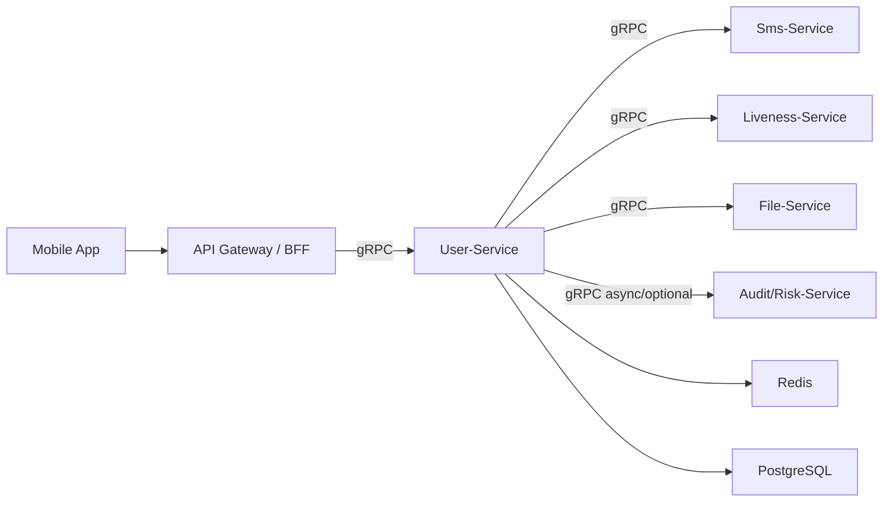

# User-Service MVP 技术设计文档

## 1. 背景与目标

User-Service 是恋爱社交 APP 的用户域服务，负责用户登录、账号身份、首次注册、基础资料和注册状态管理。当前仓库中 `user-service` 已是 Spring Boot 3.3.5、Java 21、Maven 项目，并已有 Redis、PostgreSQL、Validation、Actuator 等基础依赖。

本 MVP 版本聚焦以下目标：

- 支持快速登录、第三方登录、手机号登录。
- 首次注册必须完成活体检测。
- 活体检测通过后填写昵称、性别、年龄、头像、种族、用户类型。
- 用户类型支持真人用户和数字人用户。
- 模块间调用采用 gRPC。
- 为后续推荐、匹配、聊天、风控、审核服务提供稳定的用户基础数据。

MVP 不直接实现完整风控、复杂资料审核、关系链、推荐画像、数字人生成能力，但会保留扩展点。

## 2. 服务边界

### 2.1 User-Service 负责

- 用户主账号创建与状态管理。
- 手机号身份、第三方身份、快速登录身份绑定。
- 登录态签发与会话校验。
- 首次注册流程状态推进。
- 活体检测结果记录。
- 用户基础资料保存与读取。
- 真人 / 数字人用户类型管理。
- 对其他内部服务暴露 gRPC 查询和校验接口。

### 2.2 User-Service 不负责

- 短信验证码发送能力，由 Sms-Service 或第三方短信平台提供。
- 第三方 OAuth 授权页面和 provider token 换取能力，由 Gateway/BFF 或 Auth Adapter 完成。
- 活体检测 SDK 采集能力，由客户端和 Liveness-Service 或第三方平台完成。
- 图片上传和头像存储，由 File-Service / Media-Service 负责。
- 资料审核、内容安全、真人认证复核，由 Audit-Service / Risk-Service 扩展。
- 匹配、推荐、聊天、动态内容等业务能力。

## 3. 总体架构

### 3.1 服务角色

客户端不直接调用 User-Service 的内部 gRPC 接口。推荐入口为 API Gateway 或 BFF，对客户端暴露 HTTP/REST 或 GraphQL，并在内部通过 gRPC 调用 User-Service。



### 3.2 内部模块

- AuthModule：处理登录、token、session、refresh。
- AccountModule：管理用户主账号、手机号、第三方账号、快速登录身份。
- RegistrationModule：控制首次注册状态机。
- LivenessModule：记录活体检测结果，校验是否允许继续注册。
- ProfileModule：管理昵称、性别、年龄、头像、种族。
- UserTypeModule：管理真人用户和数字人用户类型。
- GrpcApi：暴露 UserCommandService、UserQueryService、SessionService。

### 3.3 推荐包结构

```text
site.jianjiange.userservice
  ├── api.grpc
  ├── application
  ├── domain.account
  ├── domain.auth
  ├── domain.profile
  ├── domain.registration
  ├── domain.verification
  ├── infrastructure.persistence
  ├── infrastructure.redis
  └── infrastructure.client
```

## 4. 核心领域模型

### 4.1 用户状态

```text
PENDING_LIVENESS -> PENDING_PROFILE -> ACTIVE
```

状态说明：

- PENDING_LIVENESS：账号已创建，但尚未完成活体检测。
- PENDING_PROFILE：活体检测已通过，尚未完成资料填写。
- ACTIVE：注册完成，可进入主业务流程。
- SUSPENDED：账号被风控或运营封禁。
- DELETED：账号已注销或软删除。

### 4.2 用户类型

```text
REAL_PERSON
DIGITAL_HUMAN
```

MVP 规则：

- REAL_PERSON 必须有通过的活体检测记录。
- DIGITAL_HUMAN 在 MVP 中仍需要创建账号和基础资料，但可根据业务策略决定是否要求活体检测。
- 如果产品要求所有首次注册都必须活体检测，则 DIGITAL_HUMAN 也走同一套 PENDING_LIVENESS 流程。
- 本设计默认所有首次注册均要求活体检测，以满足当前需求表述。

### 4.3 登录身份类型

```text
PHONE
THIRD_PARTY
QUICK
```

第三方 provider 建议使用字符串枚举，例如：

```text
WECHAT
APPLE
GOOGLE
```

## 5. 核心业务流程

### 5.1 手机号登录

1. 客户端提交手机号和验证码到 Gateway/BFF。
2. Gateway/BFF 调用 Sms-Service 校验验证码，或调用 User-Service 后由 User-Service 校验。
3. User-Service 查询手机号是否已绑定用户。
4. 若已存在用户，签发 access token 和 refresh token。
5. 若不存在用户，创建用户和 PHONE 身份，状态为 PENDING_LIVENESS。
6. 返回登录结果和下一步注册动作。

下一步动作：

- ACTIVE：进入主业务。
- PENDING_LIVENESS：进入活体检测。
- PENDING_PROFILE：进入资料填写。

### 5.2 第三方登录

1. 客户端完成第三方授权并拿到 provider 授权凭证。
2. Gateway/BFF 或 Auth Adapter 校验凭证并获得 provider_user_id。
3. Gateway/BFF 调用 User-Service 的 LoginWithThirdParty。
4. User-Service 查询 THIRD_PARTY 身份是否已绑定用户。
5. 若已存在用户，签发登录态。
6. 若不存在用户，创建用户和 THIRD_PARTY 身份，状态为 PENDING_LIVENESS。
7. 返回登录结果和下一步注册动作。

### 5.3 快速登录

快速登录用于降低新用户进入门槛，建议基于设备级匿名身份或临时凭证实现。

1. 客户端提交 device_id、install_id 或 quick_login_token。
2. User-Service 查询 QUICK 身份是否已存在。
3. 若存在，返回对应用户的登录态和注册状态。
4. 若不存在，创建临时用户和 QUICK 身份，状态为 PENDING_LIVENESS。
5. 后续用户绑定手机号或第三方账号时，将 PHONE / THIRD_PARTY 身份追加绑定到同一个 user_id。

MVP 约束：

- 快速登录账号未绑定手机号或第三方身份前，属于弱身份。
- 弱身份可以进入注册流程，但敏感操作应受限。
- 设备标识不能作为唯一强身份凭证，必须支持后续绑定正式身份。

### 5.4 首次注册与活体检测

1. 用户完成任意登录方式后，如果状态为 PENDING_LIVENESS，客户端进入活体检测。
2. 客户端调用 Liveness-Service 或第三方 SDK 完成采集。
3. Liveness-Service 返回检测结果、检测流水号、分数和供应商信息。
4. Gateway/BFF 调用 User-Service 提交检测结果。
5. User-Service 校验结果为 PASS 后，将用户状态推进到 PENDING_PROFILE。
6. 如果结果为 FAIL，记录失败原因和重试次数，用户保持 PENDING_LIVENESS。

MVP 默认策略：

- 每个用户每天最多允许 5 次活体检测失败。
- 活体检测通过后不允许重复覆盖为失败。
- 检测结果需要持久化，便于后续审计。

### 5.5 完善资料

用户状态为 PENDING_PROFILE 时，允许提交资料：

- 昵称。
- 性别。
- 年龄。
- 头像。
- 种族。
- 用户类型：REAL_PERSON 或 DIGITAL_HUMAN。

校验规则：

- 昵称长度 2-30。
- 年龄范围建议 18-100，恋爱社交 APP 默认必须成年。
- 头像必须是已上传成功的 media_id 或 URL。
- 性别、种族、用户类型必须在枚举范围内。
- 活体检测未通过时不能完成资料。

资料保存成功后，用户状态变更为 ACTIVE。

## 6. gRPC 接口设计

### 6.1 Proto 包建议

```proto
syntax = "proto3";

package dating.user.v1;

option java_multiple_files = true;
option java_package = "site.jianjiange.userservice.grpc.v1";
option java_outer_classname = "UserServiceProto";
```

### 6.2 UserCommandService

```proto
service UserCommandService {
  rpc QuickLogin(QuickLoginRequest) returns (LoginResponse);
  rpc LoginWithPhone(LoginWithPhoneRequest) returns (LoginResponse);
  rpc LoginWithThirdParty(LoginWithThirdPartyRequest) returns (LoginResponse);
  rpc BindPhone(BindPhoneRequest) returns (BindIdentityResponse);
  rpc BindThirdParty(BindThirdPartyRequest) returns (BindIdentityResponse);
  rpc SubmitLivenessResult(SubmitLivenessResultRequest) returns (SubmitLivenessResultResponse);
  rpc CompleteProfile(CompleteProfileRequest) returns (CompleteProfileResponse);
  rpc Logout(LogoutRequest) returns (LogoutResponse);
}
```

### 6.3 UserQueryService

```proto
service UserQueryService {
  rpc GetUser(GetUserRequest) returns (GetUserResponse);
  rpc GetUserProfile(GetUserProfileRequest) returns (GetUserProfileResponse);
  rpc BatchGetUsers(BatchGetUsersRequest) returns (BatchGetUsersResponse);
}
```

### 6.4 SessionService

```proto
service SessionService {
  rpc ValidateSession(ValidateSessionRequest) returns (ValidateSessionResponse);
  rpc RefreshToken(RefreshTokenRequest) returns (RefreshTokenResponse);
}
```

### 6.5 核心消息结构

```proto
enum UserStatus {
  USER_STATUS_UNSPECIFIED = 0;
  USER_STATUS_PENDING_LIVENESS = 1;
  USER_STATUS_PENDING_PROFILE = 2;
  USER_STATUS_ACTIVE = 3;
  USER_STATUS_SUSPENDED = 4;
  USER_STATUS_DELETED = 5;
}

enum UserType {
  USER_TYPE_UNSPECIFIED = 0;
  USER_TYPE_REAL_PERSON = 1;
  USER_TYPE_DIGITAL_HUMAN = 2;
}

enum Gender {
  GENDER_UNSPECIFIED = 0;
  GENDER_MALE = 1;
  GENDER_FEMALE = 2;
  GENDER_NON_BINARY = 3;
}

enum NextAction {
  NEXT_ACTION_UNSPECIFIED = 0;
  NEXT_ACTION_ENTER_APP = 1;
  NEXT_ACTION_DO_LIVENESS = 2;
  NEXT_ACTION_COMPLETE_PROFILE = 3;
  NEXT_ACTION_ACCOUNT_SUSPENDED = 4;
}

message LoginResponse {
  string user_id = 1;
  UserStatus status = 2;
  NextAction next_action = 3;
  string access_token = 4;
  string refresh_token = 5;
  int64 expires_in_seconds = 6;
  bool is_new_user = 7;
}

message CompleteProfileRequest {
  string user_id = 1;
  string nickname = 2;
  Gender gender = 3;
  int32 age = 4;
  string avatar_media_id = 5;
  string race = 6;
  UserType user_type = 7;
}
```

### 6.6 错误码建议

| gRPC Code | 业务码 | 场景 |
| --- | --- | --- |
| INVALID_ARGUMENT | USER_INVALID_ARGUMENT | 参数缺失或格式错误 |
| UNAUTHENTICATED | USER_SESSION_INVALID | token 无效或过期 |
| PERMISSION_DENIED | USER_STATUS_NOT_ALLOWED | 当前用户状态不允许操作 |
| NOT_FOUND | USER_NOT_FOUND | 用户不存在 |
| ALREADY_EXISTS | IDENTITY_ALREADY_BOUND | 手机号或第三方身份已绑定 |
| RESOURCE_EXHAUSTED | LIVENESS_RETRY_LIMITED | 活体检测重试超限 |
| FAILED_PRECONDITION | LIVENESS_REQUIRED | 未通过活体检测 |
| INTERNAL | USER_INTERNAL_ERROR | 服务内部错误 |

## 7. 数据库设计

### 7.1 users

用户主表。

| 字段 | 类型 | 说明 |
| --- | --- | --- |
| id | uuid / bigint | 用户 ID |
| status | varchar(32) | 用户状态 |
| user_type | varchar(32) | REAL_PERSON / DIGITAL_HUMAN |
| primary_identity_type | varchar(32) | PHONE / THIRD_PARTY / QUICK |
| created_at | timestamptz | 创建时间 |
| updated_at | timestamptz | 更新时间 |
| activated_at | timestamptz | 完成注册时间 |
| deleted_at | timestamptz | 删除时间 |

索引：

- idx_users_status
- idx_users_user_type

### 7.2 user_profiles

用户资料表。

| 字段 | 类型 | 说明 |
| --- | --- | --- |
| user_id | uuid / bigint | 用户 ID |
| nickname | varchar(64) | 昵称 |
| gender | varchar(32) | 性别 |
| age | int | 年龄 |
| avatar_media_id | varchar(128) | 头像媒体 ID |
| race | varchar(64) | 种族 |
| created_at | timestamptz | 创建时间 |
| updated_at | timestamptz | 更新时间 |

索引：

- uk_user_profiles_user_id
- idx_user_profiles_gender
- idx_user_profiles_age

### 7.3 user_auth_identities

登录身份绑定表。

| 字段 | 类型 | 说明 |
| --- | --- | --- |
| id | uuid / bigint | 主键 |
| user_id | uuid / bigint | 用户 ID |
| identity_type | varchar(32) | PHONE / THIRD_PARTY / QUICK |
| provider | varchar(32) | WECHAT / APPLE / GOOGLE 等 |
| identifier | varchar(255) | 手机号哈希、provider_user_id、设备身份等 |
| verified | boolean | 是否已验证 |
| bound_at | timestamptz | 绑定时间 |
| last_login_at | timestamptz | 最近登录时间 |
| created_at | timestamptz | 创建时间 |
| updated_at | timestamptz | 更新时间 |

索引：

- uk_auth_identity_type_provider_identifier
- idx_auth_identity_user_id

安全要求：

- 手机号不建议明文存储为 identifier，应存储规范化手机号的加盐哈希。
- 如需展示手机号，单独存储加密后的 phone_cipher_text。

### 7.4 user_liveness_verifications

活体检测记录表。

| 字段 | 类型 | 说明 |
| --- | --- | --- |
| id | uuid / bigint | 主键 |
| user_id | uuid / bigint | 用户 ID |
| provider | varchar(64) | 供应商 |
| provider_trace_id | varchar(128) | 供应商流水号 |
| result | varchar(32) | PASS / FAIL / REVIEW |
| score | numeric(6,3) | 检测分 |
| failure_reason | varchar(255) | 失败原因 |
| checked_at | timestamptz | 检测时间 |
| created_at | timestamptz | 创建时间 |

索引：

- idx_liveness_user_id
- uk_liveness_provider_trace_id

### 7.5 user_sessions

会话表，可结合 Redis 使用。

| 字段 | 类型 | 说明 |
| --- | --- | --- |
| id | uuid / bigint | session ID |
| user_id | uuid / bigint | 用户 ID |
| refresh_token_hash | varchar(255) | refresh token 哈希 |
| device_id | varchar(128) | 设备 ID |
| client_type | varchar(32) | IOS / ANDROID / WEB |
| ip | inet / varchar(64) | 登录 IP |
| user_agent | varchar(512) | UA |
| expires_at | timestamptz | 过期时间 |
| revoked_at | timestamptz | 撤销时间 |
| created_at | timestamptz | 创建时间 |

索引：

- idx_sessions_user_id
- idx_sessions_refresh_token_hash
- idx_sessions_expires_at

## 8. Redis 设计

MVP Redis 用途：

- access token 黑名单或 session 缓存。
- 短时登录态缓存。
- 活体检测失败次数计数。
- 幂等请求去重。

Key 建议：

```text
user:session:{sessionId}
user:token:blacklist:{jti}
user:liveness:fail-count:{userId}:{yyyyMMdd}
user:idempotency:{requestId}
```

## 9. 幂等与一致性

### 9.1 登录幂等

- 对同一个 identity_type + provider + identifier 建唯一索引。
- 并发登录时依赖数据库唯一约束兜底。
- 创建用户和绑定身份必须在同一事务内完成。

### 9.2 活体检测幂等

- provider_trace_id 必须唯一。
- 同一个检测流水重复提交时返回第一次处理结果。
- 用户已通过活体检测后，不再允许失败结果回滚状态。

### 9.3 完善资料幂等

- PENDING_PROFILE 状态下首次提交资料后推进为 ACTIVE。
- ACTIVE 状态再次调用 CompleteProfile 可以按资料更新处理，或返回状态不允许。
- MVP 建议 CompleteProfile 只用于首次资料完成，资料更新后续单独设计 UpdateProfile。

## 10. 安全与合规

MVP 必须具备：

- token 使用服务端签名，access token 短期有效，refresh token 长期有效且可撤销。
- refresh token 只存哈希，不存明文。
- 手机号、第三方 open id、设备标识等敏感身份信息不可直接明文暴露。
- 所有登录和注册接口需要记录审计日志。
- 用户必须年满 18 岁才能完成注册。
- 活体检测结果只保存必要字段，不保存生物识别原始素材。
- gRPC 内部服务调用应使用 mTLS 或服务网格鉴权，MVP 可先预留配置。

## 11. 可观测性

Actuator 已作为基础依赖，MVP 建议补充：

- 登录成功率、登录失败率。
- 新用户创建数。
- 活体检测通过率、失败率。
- 注册漏斗：登录成功 -> 活体通过 -> 资料完成 -> ACTIVE。
- gRPC 请求耗时、错误码分布。
- 数据库唯一约束冲突次数。

日志字段建议：

- trace_id
- request_id
- user_id
- identity_type
- provider
- user_status
- next_action
- grpc_method
- business_code

## 12. 测试策略

### 12.1 单元测试

- 用户状态机转换。
- 登录身份绑定唯一性。
- 活体检测结果处理。
- 完善资料参数校验。
- next_action 计算。

### 12.2 集成测试

- 手机号首次登录创建用户。
- 手机号再次登录复用用户。
- 第三方首次登录创建用户。
- 快速登录后绑定手机号。
- 活体检测通过后进入 PENDING_PROFILE。
- 完善资料后进入 ACTIVE。

### 12.3 契约测试

- gRPC proto 字段兼容性。
- 错误码映射。
- SessionService ValidateSession 对 Gateway/BFF 的兼容。

## 13. MVP 实施顺序建议

1. 增加 gRPC 和 protobuf 构建依赖。
2. 定义 user-service proto 契约。
3. 建立领域枚举、实体和值对象。
4. 建立 PostgreSQL 表结构迁移。
5. 实现手机号登录和快速登录。
6. 实现第三方登录的 provider identity 入口。
7. 实现活体检测结果提交和状态推进。
8. 实现首次资料完成。
9. 实现 session 校验和 refresh token。
10. 补充核心单元测试和集成测试。

## 14. 开放问题与默认决策

| 问题 | MVP 默认决策 |
| --- | --- |
| 数字人是否必须活体检测 | 是，所有首次注册统一要求活体检测 |
| 快速登录是否允许进入主业务 | 不允许，必须完成活体检测和资料填写 |
| ACTIVE 后是否能用 CompleteProfile 更新资料 | 不建议，后续单独设计 UpdateProfile |
| 手机号是否明文存储 | 不明文作为查询标识，使用哈希；展示需求用加密字段 |
| 用户 ID 类型 | 推荐 uuid，若全站已有 ID 服务可替换为 bigint |
| 第三方 token 校验在哪里做 | 推荐 Gateway/BFF 或 Auth Adapter 做，User-Service 接收已校验身份 |

## 15. 验收标准

- 三种登录方式均能返回统一的 LoginResponse。
- 新用户首次登录后状态为 PENDING_LIVENESS。
- 活体检测通过后状态变为 PENDING_PROFILE。
- 完善资料成功后状态变为 ACTIVE。
- 未通过活体检测的用户不能完成资料。
- 手机号、第三方身份、快速登录身份均可绑定到同一用户。
- 内部服务可通过 gRPC 校验 session 和查询用户基础资料。
- 核心流程具备单元测试和集成测试覆盖。
