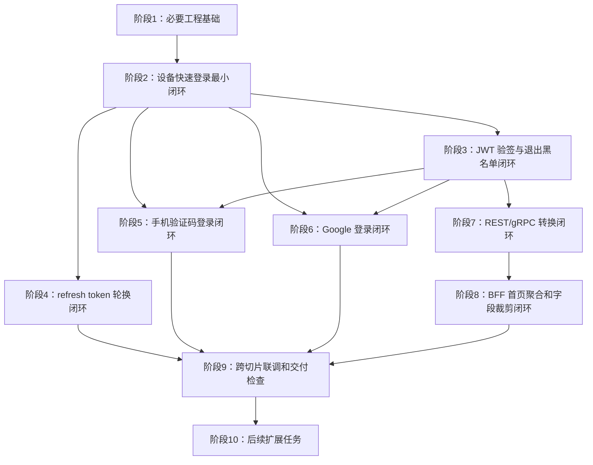

# 开发任务总览

## 1. 项目背景

`mobile-gateway` 是 DateAPP 的基础网关微服务，MVP 阶段同时承担外部 REST 入口、认证登录、JWT 会话、REST/gRPC 协议转换和轻量 BFF 只读聚合能力。

本拆分以纵向行为闭环为主，不按“先建表、再写 Mapper、再写 Service、再写 Controller”的横向方式拆分。每个业务阶段都应能通过单元测试、集成测试、HTTP API 测试、gRPC mock / grpcurl、Redis 或数据库状态完成验收。

## 2. 输入依据

- 最终技术方案：`outputs/最终方案/01-最终技术方案.md`
- 需求澄清：`outputs/需求澄清/01-需求澄清.md`
- 技术评审 / 复审 / 终审：`outputs/方案评审/`
- 团队技术约束：`C:/Users/wangjun/Desktop/DateAPP开发相关/team-constraints.md`

## 3. 默认假设

- 技术栈按最终方案执行：JDK 21、Spring Boot 3.3.5、Spring MVC、虚拟线程、Maven、MyBatis-Plus、PostgreSQL 16、Redis 7、Nacos 2.4、gRPC 1.68.1、Protobuf 4.28.3、Docker。
- 基础包名使用 `com.dating.gateway`。
- 数据库 migration 路径以 `src/main/resources/db/migration/` 表示；具体 Flyway / Liquibase / 内部 migration 工具按项目实际约定落地。
- user-service 的 `RegisterOrInitialize` proto 字段先按最终方案建议字段落地，可在联调时向后兼容补字段。
- 短信供应商先通过 `SmsProviderClient` 抽象和 Mock 实现验收，真实供应商适配不阻塞认证闭环。
- 生产 CORS 白名单、P95 / P99 目标值属于部署或压测阶段确认项，不阻塞开发拆分。

## 4. 纵向切片拆分策略

拆分顺序遵循：

1. 先完成多个切片共同依赖的最小工程基础；
2. 用设备号快速登录打通账号、设备、user-service 初始化、JWT access token 签发和 refresh token 持久化的最小认证闭环；
3. 在已有 token 基础上补齐 JWT 验签、上下文注入、退出和 Redis blacklist；
4. 再补齐 refresh token 轮换；
5. 依次接入手机号验证码登录、Google 登录；
6. 认证上下文稳定后再做 REST/gRPC 转换和 BFF 聚合；
7. 最后做跨切片联调、部署检查和 P95 / P99 验证。

## 5. 耦合度排序说明

| 阶段 | 阶段名称 | 耦合度等级 | 耦合度总分 | 排序理由 |
| --- | --- | --- | --- | --- |
| 1 | 必要工程基础 | 低耦合 | 3 | 不依赖业务数据和外部服务，是后续所有切片共同依赖的最小骨架。 |
| 2 | 设备快速登录最小闭环 | 中耦合 | 6 | 依赖 PostgreSQL、Redis、user-service gRPC mock，但没有短信或 Google 第三方依赖，是最容易打通的完整登录闭环。 |
| 3 | JWT 验签与退出黑名单闭环 | 中耦合 | 5 | 依赖阶段 2 的 token，使用 Redis blacklist，是后续业务入口鉴权的基础。 |
| 4 | refresh token 轮换闭环 | 中耦合 | 5 | 依赖 refresh token 表和 JwtService，主要是本服务内事务和 Redis 缓存。 |
| 5 | 手机验证码登录闭环 | 中耦合 | 6 | 复用账号和 token 能力，新增 Redis 验证码和短信供应商适配。 |
| 6 | Google 登录闭环 | 中耦合 | 7 | 复用账号和 token 能力，新增 Google JWKS / token 校验第三方依赖。 |
| 7 | REST/gRPC 转换闭环 | 中耦合 | 6 | 依赖 JWT 上下文和一个下游 gRPC 契约，验证公网 REST 到内部 gRPC 的主链路。 |
| 8 | BFF 首页聚合和字段裁剪闭环 | 高耦合 | 8 | 依赖认证上下文、多个下游只读接口和字段裁剪规则，应晚于单服务 adapter。 |
| 9 | 跨切片联调和交付检查 | 高耦合 | 8 | 汇总认证、Redis、DB、gRPC、Docker、指标和压测，不承载新业务能力。 |
| 10 | 后续扩展任务 | 高风险聚合 | 12 | 非 MVP，包括账号绑定、多密钥轮换、多实例 worker-id、登录审计等。 |

## 6. 阶段总览表

| 阶段 | 阶段名称 | 类型 | 目标 | 耦合度等级 | 耦合度总分 | 是否 MVP 必做 | 输出文件 | 前置依赖 |
| --- | --- | --- | --- | --- | --- | --- | --- | --- |
| 1 | 必要工程基础 | 必要前置 | 建立工程骨架、统一返回、业务码、配置、traceId、CORS、限流基础、Redis key 前缀和 gRPC 契约骨架 | 低耦合 | 3 | 是 | `01-阶段1-必要工程基础.md` | 无 |
| 2 | 设备快速登录最小闭环 | 中耦合纵向切片 | 通过 `/api/v1/auth/login/device` 打通账号、设备、user_id、user-service 初始化、JWT access token 签发和 refresh token 持久化 | 中耦合 | 6 | 是 | `02-阶段2-设备快速登录最小闭环.md` | 阶段 1 |
| 3 | JWT 验签与退出黑名单闭环 | 中耦合纵向切片 | 让业务请求可被 JWT 鉴权，退出时写 Redis blacklist 并拒绝已退出 token | 中耦合 | 5 | 是 | `03-阶段3-JWT验签与退出黑名单闭环.md` | 阶段 2 |
| 4 | refresh token 轮换闭环 | 中耦合纵向切片 | 通过 `/api/v1/auth/refresh` 完成 refresh token 校验、条件轮换、重复使用检测和新 token 签发 | 中耦合 | 5 | 是 | `04-阶段4-refresh-token轮换闭环.md` | 阶段 2 |
| 5 | 手机验证码登录闭环 | 中耦合纵向切片 | 完成验证码发送、校验、PHONE 账号创建 / 登录和 token 签发 | 中耦合 | 6 | 是 | `05-阶段5-手机验证码登录闭环.md` | 阶段 2、阶段 3 |
| 6 | Google 登录闭环 | 中耦合纵向切片 | 完成 Google ID token 校验、GOOGLE 账号创建 / 登录和 token 签发 | 中耦合 | 7 | 是 | `06-阶段6-Google登录闭环.md` | 阶段 2、阶段 3 |
| 7 | REST/gRPC 转换闭环 | 中耦合纵向切片 | 完成代表性 REST 到 user-service gRPC 的转换、metadata 透传、错误码映射和超时处理 | 中耦合 | 6 | 是 | `07-阶段7-REST-gRPC转换闭环.md` | 阶段 3 |
| 8 | BFF 首页聚合和字段裁剪闭环 | 高耦合聚合切片 | 完成 `/api/v1/bff/home` 只读聚合、一级字段白名单、部分失败和超时降级 | 高耦合 | 8 | 是 | `08-阶段8-BFF首页聚合和字段裁剪闭环.md` | 阶段 7 |
| 9 | 跨切片联调和交付检查 | 联调验收 | 完成端到端联调、Docker / 配置检查、指标埋点和 P95 / P99 压测准备 | 高耦合 | 8 | 是 | `09-阶段9-跨切片联调和交付检查.md` | 阶段 1-8 |
| 10 | 后续扩展任务 | 后续扩展 | 记录非 MVP 能力，避免混入当前开发主线 | 高风险聚合 | 12 | 否 | `10-阶段10-后续扩展任务.md` | 阶段 9 |

## 7. 阶段依赖关系

## 8. 数据库低耦合落地顺序

| 落地阶段 | 表 / 数据 | 说明 |
| --- | --- | --- |
| 阶段 2 | `gateway_account` | 第一个认证闭环必须创建账号和全局 `user_id`。 |
| 阶段 2 | `gateway_device` | 设备快登闭环必须保证一个 `device_key_hash` 只对应一个 `user_id`。 |
| 阶段 2 | `gateway_refresh_token` | 设备登录成功需要签发并持久化 refresh token。 |
| 阶段 3 | Redis `jwt:blacklist:{jti}` | 不建 PostgreSQL blacklist 表，只使用 Redis。 |
| 阶段 4 | `gateway_refresh_token.status` 条件更新 | 复用阶段 2 表结构，补齐 ACTIVE -> ROTATED / REVOKED 事务。 |
| 阶段 5 | Redis `sms-code` / `sms-cooldown` | 手机验证码只放 Redis，校验成功立即删除。 |
| 阶段 6 | JWKS 本地缓存 / 可选 Redis 缓存 | Google token 校验缓存，不引入新表。 |

## 9. 循环依赖识别和处理

- `mobile-gateway` 和 user-service 不存在互相阻塞：阶段 1 先定义 `RegisterOrInitialize` proto / mock，阶段 2 起由网关调用 user-service；user-service 以 `user_id` 幂等，不需要反向依赖网关状态。
- 登录事务和 user-service 初始化不做跨服务事务：网关本地事务提交后再调用 gRPC；初始化失败保留 `user_register_status=0`，下次登录按第一次进入重试。
- REST/gRPC 和 BFF 不做跨服务写事务：阶段 7、8 只读或请求转发，不反向依赖认证表写入。

## 10. MVP 必做范围

- Spring Boot MVC + JDK 21 虚拟线程。
- 手机验证码登录 / 注册。
- Google 登录 / 注册。
- 设备号快速登录 / 注册。
- 雪花算法生成全局 `user_id`。
- 首次注册后调用 user-service 注册 / 初始化。
- JWT 签发、验签和 Redis blacklist。
- refresh token 持久化和轮换。
- 账号、设备、refresh token 持久化。
- 限流、CORS、traceId。
- REST/gRPC 转换。
- BFF 只读聚合和一级字段裁剪。

## 11. 后续可做范围

- 账号绑定、账号合并、设备快登升级为正式账号。
- Apple / 微信等第三方登录。
- 登录审计表。
- JWT `kid` 和多密钥在线轮换。
- 多实例 worker-id 分配和启动冲突检测。
- 更精细风控策略。
- 管理后台和运维接口。
- OpenAPI 文档自动发布。

## 12. 推荐执行顺序

1. 完成阶段 1，确保工程能启动、配置能加载、基础测试能跑。
2. 完成阶段 2，用设备快登打通第一条完整认证闭环。
3. 完成阶段 3 和阶段 4，让 access token 和 refresh token 生命周期可验证。
4. 完成阶段 5 和阶段 6，补齐手机号与 Google 两条登录方式。
5. 完成阶段 7 和阶段 8，接入 REST/gRPC 转换和 BFF。
6. 完成阶段 9，做全链路联调、部署检查和性能指标验证。

## 13. 风险点和待确认事项

| 风险 / 待确认项 | 是否阻塞 | 推荐处理 |
| --- | --- | --- |
| user-service `RegisterOrInitialize` proto 具体字段 | 否 | 阶段 1 先按 `user_id`、`account_type`、`register_source`、`trace_id` 建契约，联调时向后兼容。 |
| 短信供应商具体接口 | 否 | 阶段 5 用 `SmsProviderClient` mock 验收，真实供应商适配作为同阶段子任务或部署前任务。 |
| 生产 CORS 白名单 | 否 | 阶段 9 部署检查时确认。 |
| P95 / P99 目标值 | 否 | 阶段 9 先提供压测脚本和指标输出，目标值结合业务规模确认。 |
| MVP 固定 worker-id 单实例约束 | 否 | 阶段 1 配置默认 `worker-id=1`；阶段 9 加部署检查，避免多实例误部署。 |

## 14. 文件清单

| 文件 | 作用 |
| --- | --- |
| `00-开发任务总览.md` | 查看整体阶段、依赖关系、耦合度排序和优先级。 |
| `01-阶段1-必要工程基础.md` | 创建最小工程骨架和公共约定。 |
| `02-阶段2-设备快速登录最小闭环.md` | 打通第一条完整认证闭环。 |
| `03-阶段3-JWT验签与退出黑名单闭环.md` | 补齐鉴权、认证上下文和退出 blacklist。 |
| `04-阶段4-refresh-token轮换闭环.md` | 补齐 refresh token 生命周期。 |
| `05-阶段5-手机验证码登录闭环.md` | 补齐手机号验证码登录 / 注册。 |
| `06-阶段6-Google登录闭环.md` | 补齐 Google 登录 / 注册。 |
| `07-阶段7-REST-gRPC转换闭环.md` | 打通公网 REST 到内部 gRPC。 |
| `08-阶段8-BFF首页聚合和字段裁剪闭环.md` | 打通 BFF 只读聚合和字段裁剪。 |
| `09-阶段9-跨切片联调和交付检查.md` | 完成端到端验收、配置、Docker 和指标检查。 |
| `10-阶段10-后续扩展任务.md` | 记录非 MVP 后续能力。 |

## 15. 当前最应该先做的 3~5 个任务

1. 初始化 `mobile-gateway` Maven 工程、JDK 21、Spring Boot MVC 和虚拟线程配置。
2. 落地统一 `Result<T>`、数值型业务码、全局异常处理、traceId 和日志脱敏规范。
3. 建立 Nacos 配置绑定，尤其是 `gateway.redis.key-prefix`、JWT 密钥、HMAC secret、固定 `worker-id=1`。
4. 定义 user-service `RegisterOrInitialize` proto / mock，并保证 gRPC deadline 与 traceId metadata 可用。
5. 开始阶段 2 的设备快速登录最小闭环，用它验证账号、设备、`user_id`、refresh token 和 JWT 的主链路。
